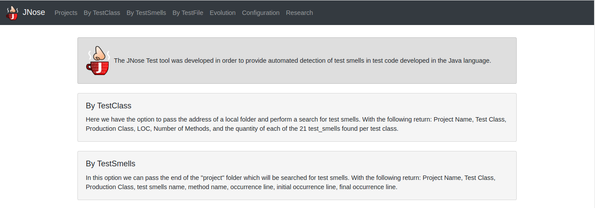
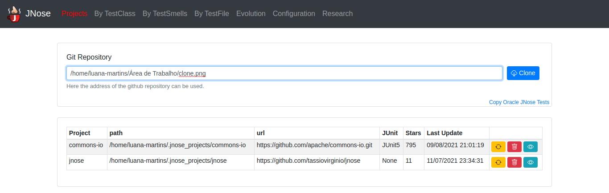

JNose Test Features
==============================

On the home screen we have a dexcription for the analysis mode and a menu with the options:

    * Projects:
    * By TestClass: performs the search based on the test class, returning the quantity of each type of test smells found in each class.
    * By TestSmells: performs the search based on the smell of the test, displaying in which class and in which line that it was found.
    * By TestFile:
    * Evolution: Search in the project repository(git) looking for test smells in each commit/tag done.
    * Configuration: We have the option to choose which test smells we want to perform the research, by default all are selected.

Cloning software projects
------------------------------

Initially, we paste the repository link on the `Git repository` field. E.g: https://github.com/tassiovirginio/jnose.
After paste the address of the repository, you can see that the project on the page and you can update this project for the latest version by using git pull function any time. In the box below, all projects will be displayed.

Then you can choose the test smells you want to analyze in the project. Go to `Configuration` in the top menu.

Configuration
-------------------------------

By TestClass
-------------------------------

By TestSmells
-------------------------------

By TestFile
-------------------------------

Evolution
-------------------------------

Research
-------------------------------
Not implemented yet!
