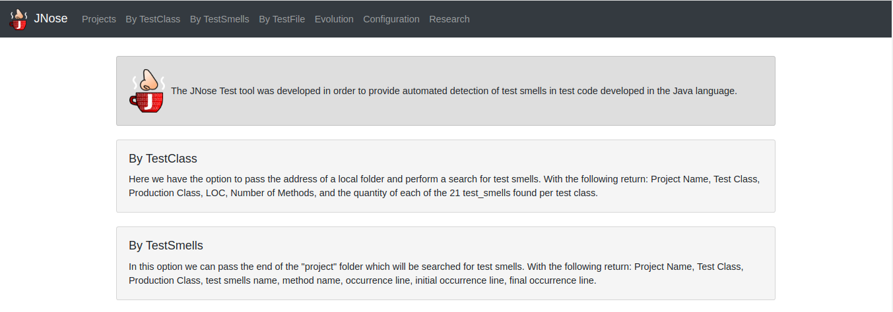

Features
==============================

The JNose Test home screen presents a description for the analysis mode and a menu with the options:

    * Projects: clones repositories from GitHub
    * By TestClass: performs the detection in all test classes of a project, returning the quantity of each type of test smells by class.
    * By TestSmells: performs the detection of all test smells of a project, returning the class and line of each detected test smell.
    * By TestFile: performs the search in only one test file, returning the location of each detected test smell.
    * Evolution: performs the test smells detection through the project history (commits or tags), returning the commit SHA, the location and the author of the test smell.
    * Configuration: presents a menu to configure which test smells the user wants to detect, by default all test smells are selected.

Cloning software projects
------------------------------

Initially, we paste the repository link on the `Git repository` field. E.g: https://github.com/tassiovirginio/jnose.

The tool clones the repository on your machine, in the directory `./jnose`. The tool displays all the projects from the `./jnose` directory at the web page, and provides options to update, delete and visualize information about the projects.

.. image:: images/clone.png
  :alt: Clonning a project with JNose Test

For now, the jNose Test supports the analysis of projects with test cases written with JUnit4. Therefore, JNose Test does not present projects without test cases in other screens, and its accuracy may not as good as it is for JUnit4.

Configuration
-------------------------------

.. image:: images/config.png
  :alt: Configuring the JNose Test execution

By TestClass
-------------------------------

.. image:: images/by-test-class.png
  :alt: By TestClass

.. image:: images/result-by-class.png
  :alt: Result of the execution By TestClass

By TestSmells
-------------------------------

.. image:: images/by-test-smells.png
  :alt: By TestSmells

.. image:: images/result-by-test-smell.png
  :alt: Result of the execution By TestSmell

By TestFile
-------------------------------

.. image:: images/by-test-file.png
  :alt: By TestFile

Evolution
-------------------------------

.. image:: images/by-test-class.png
  :alt: By TestClass

.. image:: images/result-evolution1.png
  :alt: Result of the execution Evolution

.. image:: images/result-evolution2.png
  :alt: Result of the execution Evolution in a chart

Research
-------------------------------
Not implemented yet!
