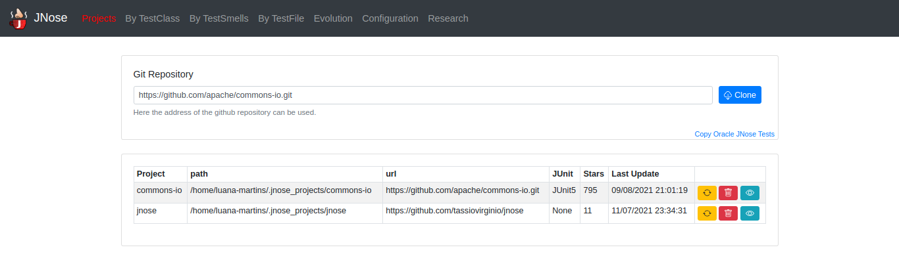
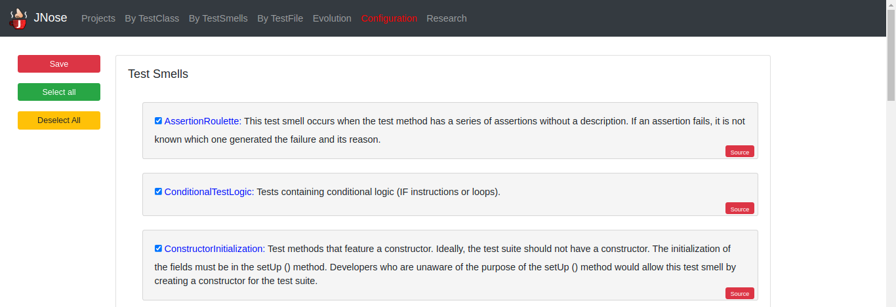
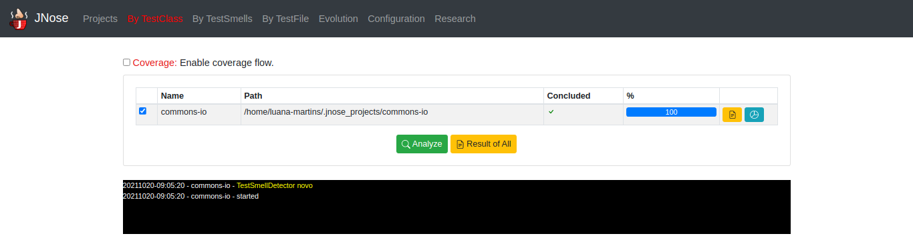

Features
==============================

The JNose Test home screen presents a description for the analysis mode and a menu with the options:

.. image:: images/home-page.png
  :alt: Home page of JNose Test

    * Projects: clones repositories from GitHub
    * By TestClass: performs the detection in all test classes of a project, returning the quantity of each type of test smells by class.
    * By TestSmells: performs the detection of all test smells of a project, returning the class and line of each detected test smell.
    * By TestFile: performs the search in only one test file, returning the location of each detected test smell.
    * Evolution: performs the test smells detection through the project history (commits or tags), returning the commit SHA, the location and the author of the test smell.
    * Configuration: presents a menu to configure which test smells the user wants to detect, by default all test smells are selected.

Cloning software projects
------------------------------

Initially, we paste the repository link on the `Git repository` field. E.g: https://github.com/tassiovirginio/jnose.

The tool clones the repository on your machine, in the directory `./jnose`. The tool displays all the projects from the `./jnose` directory at the web page, and provides options to update, delete and visualize information about the projects.

For now, the jNose Test supports the analysis of projects with test cases written with JUnit4. Therefore, JNose Test does not present projects without test cases in other screens, and its accuracy may not as good as it is for JUnit4.

Configuration
-------------------------------

By TestClass
-------------------------------

The analysis mode `By TestClass` counts the number of each test smell in a class level. Optionally, you can also enable the coverage metrics calculation.

Initially, you need to specify the projects that you want to analyze. By default, the analysis `By TestClass` is performed in the latest version of the selected projects and does not require information about other project versions. Therefore, if you want to analyze other versions, you can go to the directory of the project under analysis (e.g., ../home/.jnose_projects/commons-io) and use the command ``git checkout COMMIT_SHA`` to change the projects version.

Once the execution is over, you can visualize the results and generates a `.csv` file with the results of the data analysis by test class. Each `.csv` row corresponds to a given test class, and each column represents the type of parameter collected: project name, test class and production class location, twenty-one types  of test smells, the number of test class lines, the number of test methods, and five columns with coverage data.

By TestSmells
-------------------------------

The analysis mode `By TestSmells` identifies the exact location of each test smell.

Initially, you need to specify the projects that you want to analyze. By default, the analysis `By TestSmells` is performed in the latest version of the selected projects and does not require information about other project versions. Therefore, if you want to analyze other versions, you can go to the directory of the project under analysis (e.g., ../home/.jnose_projects/commons-io) and use the command ``git checkout COMMIT_SHA`` to change the projects version.

Once the execution is over, you can visualize the results and generates a `.csv` file with the results of the data analysis by test smells.
Unlike the previous analysis, `By TestClass`, the JNose Test provides the exact method and line where the test smell is located. Each row of the `.csv` represents a test smell, and it has six columns to show the type of parameter collected, the project name, the test class and the production class location, the test smell name, the method of the test smell location in number of line, and the method name.

By TestFile
-------------------------------

Evolution
-------------------------------

The analysis mode `Evolution` identifies the exact location of each test smell for each project version, in addition to data about the author who committed the test smell.

Initially, you need to specify the projects that you want to analyze and the search type you want to apply: by commits or by tags. The execution is performed from the first commit or tag to the last one. For now, there is no way to select a specific interval to execute the tool.

Once the execution is over, you can visualize the results and generates a `.csv` file with the results of the data analysis by test smells.
The `.csv` rows represent the test smell by commit or tag; and the columns have the following collected parameters: SHA, commiter, date, commit message, tag name, project name, test class and production class location, test smells, commit identification. To find out who committed the test smell, the tool automatically calculates the authorship of a test smell by guilt, i.e., for the tester who last modified the method (and did not fixed it), assuming that he was aware of the problem and attribute to him the authorship.

You can also generete charts to analyze the test smells evolution.

Research
-------------------------------
Not implemented yet!
